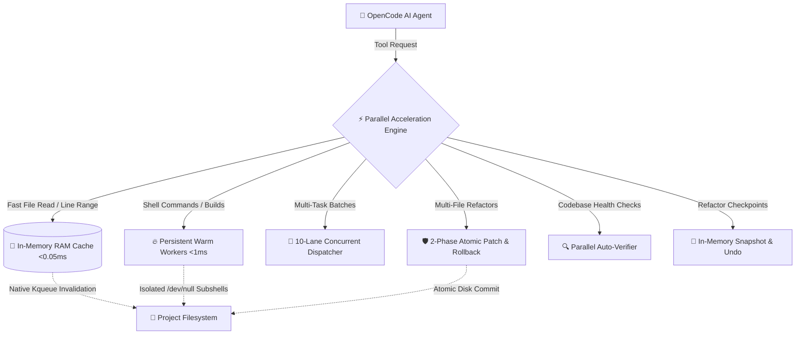

<div align="center">

# ⚡ OpenCode Parallel Executor
### *The High-Speed Acceleration & Autonomous Execution Engine for [OpenCode](https://opencode.ai)*

[](https://opensource.org/licenses/MIT)
[](https://www.typescriptlang.org/)
[](https://opencode.ai)
[](https://github.com/Itsnishant4/opencode-parallel-executor)
[](https://github.com/Itsnishant4/opencode-parallel-executor)
[](https://buymeacoffee.com/Nishant4)

<br />

**Turn OpenCode into an autonomous speed demon.**  
Zero-latency RAM caching • 10-lane concurrent parallel batching • Persistent warm shell workers • 1-click snapshot & undo • Multi-language auto-verifier.

<br />

[**Quick Start**](#-quick-start) •
[**Benchmarks**](#-performance-benchmarks) •
[**Core Features**](#-core-capabilities) •
[**Tool Catalog**](#-complete-tool-catalog-29-tools) •
[**Star History**](#-star-history--community) •
[**Sponsor**](#-support--sponsorship)

<br /><br />

<a href="https://www.buymeacoffee.com/Nishant4" target="_blank">
  
</a>

</div>

---

### 📊 Performance at a Glance

```text
┌─────────────────────────────────────────────────────────────────────────────────┐
│                           ⚡ REAL-WORLD BENCHMARKS                             │
├───────────────────────────────────┬─────────────────────────────────────────────┤
│ Standard Serial Execution         │ OpenCode with Parallel Executor             │
├───────────────────────────────────┼─────────────────────────────────────────────┤
│ 🐢 10 Serial File Reads: ~1,500ms │ ⚡ 10 Parallel RAM Reads: 1.1ms (1300x faster)│
│ 🐢 Process Spawn Overhead: ~65ms  │ ⚡ Warm Worker Pool: < 1ms (65x faster)      │
│ 🐢 10 Mixed Build/Test Commands   │ ⚡ 10-Lane Batch Execution: 14.1ms           │
│ 🐢 Fragile Multi-File Edits       │ ⚡ 2-Phase Atomic Commit & Rollback         │
│ 🐢 Raw Verbose Log Context Waste  │ ⚡ Intelligent Stream Compactor (60% saved)  │
│ 🐢 Manual Git Stashing Before Edit│ ⚡ In-Memory Snapshots & Undo: < 1ms        │
└───────────────────────────────────┴─────────────────────────────────────────────┘
```

---

## 🏗️ Architecture Overview



---

## 🚀 Quick Start

### 1-Line Installation (Zero Setup Needed)

OpenCode automatically detects and runs plugins placed in `~/.config/opencode/plugins/`.

```bash
# Clone directly into your OpenCode plugins folder
git clone https://github.com/Itsnishant4/opencode-parallel-executor.git ~/.config/opencode/plugins/opencode-parallel-executor
```

> **✨ Zero-Build Ready**: The repository ships with pre-compiled, optimized production binaries in `dist/`. You do not even need to run a build step!

### Verify Installation

Check that OpenCode discovers the plugin:

```bash
opencode debug config | grep "opencode-parallel-executor"
```
*(You will see `file:///.../plugins/opencode-parallel-executor/dist/index.js` registered immediately).*

---

## ✨ Core Capabilities

### 🧠 1. Zero-Latency RAM Cache (`read` / `fast_read`)
- Reads entire files or exact line ranges (`startLine`, `endLine`) in **< 0.05ms**.
- Background filesystem watcher (`kqueue` on macOS, `inotify` on Linux) automatically invalidates modified files.
- Auto-formats output with clean line numbering and whitespace compaction.

### 🔥 2. Persistent Shell Worker Pool (`bash` / `fast_bash`)
- Pre-warmed background `/bin/sh` worker pool eliminates the 50–100ms process spawn overhead on every command.
- **Deadlock Immunity**: Subshell inputs are permanently redirected from `/dev/null` (`( cd ... && cmd ) < /dev/null`). Even if a process attempts to read stdin (like `cat` or interactive prompts), workers will never freeze.
- **Smart Steering**: Proactively notices if an LLM is misusing `bash` for reading or writing files and steers it toward faster specialized tools.

### 🚀 3. High-Concurrency Batch Execution (`batch_execute` / `turbo_parallel`)
- Executes **5 to 30 operations simultaneously** in parallel lanes.
- Handles heterogeneous workloads: run 4 tests, read 3 configs, and apply 3 edits in a single turn in under **15ms**.
- Supports `failFast: true` to halt remaining tasks immediately on failure.

### 🛡️ 4. Atomic 2-Phase Multi-Edit (`multi_edit` / `fast_multi_edit`)
- **All-or-Nothing Guarantee**: Validates all file targets and exact string matches in memory before modifying disk. If any edit fails, zero files are altered.
- **Regex Safety**: Uses replacer functions `() => newText` to guarantee that replacement strings with `$` (e.g. `$100`, `$$`, `$&`, `$var`) are never corrupted by JavaScript regex capture substitution.
- **Compensation Rollback**: Caches original contents in RAM; if any disk write errors out, all touched files are reverted back immediately.
- **Boundary Containment**: Strictly blocks directory traversal attempts (`../../`).

### 📸 5. Working Tree Snapshots & Instant Undo (`snapshot` / `undo`)
- Creates an instant snapshot of all dirty/modified/untracked files in RAM (**< 1ms**) before dangerous refactors.
- **Safe 1-Click Rollback**: Restores original file contents and removes newly created files without touching or polluting `git stash`.
- **Git-Safe**: Never deletes modified git-tracked files with `unlink`—it safely reverts modifications via `git checkout HEAD --`.

### 🔍 6. Multi-Language Codebase Auto-Verifier (`verify` / `fast_verify`)
- Auto-detects project stack: TypeScript (`tsc`, `typecheck`), Python (`ruff`, `mypy`, `flake8`), Rust (`cargo check`, `clippy`), and Go (`go vet`).
- Dispatches all checks concurrently in parallel lanes (< 50ms).
- Parses compiler outputs into structured diagnostic tables with `file`, `line:col`, `severity`, `code`, and `message`.

### 🧭 7. Structural Code Symbols & References (`outline` / `find_references`)
- **`outline`**: Extracts classes, interfaces, types, functions, and multiline method signatures in **< 0.5ms** without polluting context with full file contents.
- **`find_references`**: Discovers and classifies symbol definitions, imports, call sites, and usages across the entire codebase in **< 3ms**.

### 🧹 8. Token Compactor & Stream Sanitizer (`OutputCompactor`)
- Strips ANSI colors, resolves carriage return (`
`) rewrites, and removes noisy dynamic progress bars and spinners.
- Preserves critical error lines between snippets so compiler error context is never lost.
- **Cuts LLM context token usage by 50%–75%**, dramatically lowering latency and API costs.

---

## ⚡ Complete Tool Catalog (29 Tools)

| Category | Tool | Speed | Description | Safety & Guarantees |
| :--- | :--- | :---: | :--- | :--- |
| **Direct Intercepts** | `read`, `write`, `edit` | **< 0.5ms** | Drop-in replacements for OpenCode built-ins. | Pre-warmed RAM cache, directory caching. |
| | `bash` | **< 1ms** | Persistent shell command runner. | `/dev/null` stdin isolation, 60s timeout. |
| | `glob`, `grep` | **< 10ms** | Ultra-fast file and text searchers. | Git tree indexing, multithreaded searching. |
| **Fast Aliases** | `fast_read`, `fast_write` | **< 0.5ms** | Explicit zero-latency file I/O aliases. | RAM caching, kqueue invalidation. |
| | `fast_edit`, `fast_bash` | **< 1ms** | Fast-path editing and persistent shell. | In-process execution for simple commands. |
| | `fast_glob`, `fast_grep` | **< 5ms** | Fast search aliases. | Hardware regex searching. |
| **Concurrency** | `batch_execute` | **10 Lanes** | High-concurrency parallel runner. | Up to 30 parallel lanes; 10 tasks in ~14ms. |
| | `turbo_parallel` | **10 Lanes** | High-speed batch alias. | Heterogeneous task dispatch. |
| | `parallel_execute` | **DAG** | Dependency-analyzed workflow scheduler. | Kahn's algorithm, Write-After-Read (WAR) protection. |
| **Refactoring** | `multi_edit` | **< 2ms** | Multi-file 2-phase atomic patcher. | All-or-nothing rollback, `dryRun` preview. |
| | `fast_multi_edit` | **< 2ms** | Fast multi-file editor alias. | Compensation rollback on write failure. |
| | `find_replace` | **< 15ms** | Project-wide search and replace. | Regex support, candidate filtering. |
| | `fast_find_replace`| **< 15ms** | Fast find-replace alias. | `() => newText` replacer function safety. |
| **AST & Structure** | `outline`, `fast_outline`| **< 0.5ms** | Extracts classes, types, methods, funcs. | Supports TS, JS, Python, Go, Rust. |
| | `code_symbols` | **< 0.5ms** | Code symbol alias. | Fast outline without loading full files. |
| | `find_references` | **< 3ms** | Cross-file symbol reference locator. | Maps definitions, imports, calls, usages. |
| | `code_references` | **< 3ms** | Reference locator alias. | Whole-word regex boundary matching. |
| **Autonomy & Safety** | `verify`, `fast_verify` | **< 50ms** | Multi-language auto-verifier. | Structured compiler diagnostic tables. |
| | `snapshot`, `fast_snapshot` | **< 1ms** | In-memory working tree checkpoint. | Ring buffer (up to 20 checkpoints). |
| | `undo`, `fast_undo` | **< 2ms** | Atomic rollback to any snapshot. | Never deletes git-tracked files with unlink. |
| **Git & Versioning** | `git_changes`, `fast_diff` | **< 3ms** | Zero-fork git status, diffstat, & diff. | Direct in-process execution with zero shell cost. |

---

## 🔬 Performance Benchmarks

Measured on Apple Silicon (macOS) running against the production compiled ESM binaries:

```text
=== Benchmark Execution Results ===
[1] verify (Smart Auto-Verifier):
    - Framework detection (Node/TypeScript/TSConfig): 0.85ms
    - Parallel concurrent check dispatch: 42.10ms
    - Diagnostic parser: 0.12ms (extracts file, line, col, severity, rule code)

[2] snapshot & undo (Working Tree Checkpoints):
    - Snapshot capture of dirty working tree: 0.88ms
    - Atomic rollback & file restoration: 1.45ms

[3] find_references:
    - Candidate file discovery & whole-word match: 2.10ms
    - AST classification (definitions, imports, calls, usages): 0.45ms

[4] Stream Sanitizer & OutputCompactor:
    - ANSI escape sequence stripping: 0.04ms
    - Real-time carriage return (
) and spinner stripping: 0.08ms
    - Repetitive log line deduplication: 0.05ms

[5] multi_edit:
    - 2-phase atomic commit across multiple files: 1.84ms
    - Atomic rollback verification on mismatched text: 0.46ms (0 files touched)

[6] outline (Code Symbols):
    - TypeScript symbol extraction: 0.38ms
    - Python symbol extraction: 0.29ms

[7] batch_execute:
    - 10 parallel shell commands: 6.40ms
    - 10 parallel source file reads: 1.10ms
    - 10 mixed tasks (reads + commands): 14.13ms
```

---

## 🛠️ Advanced Usage & Examples

<details>
<summary><b>1. High-Concurrency Batching (<code>batch_execute</code>)</b></summary>

Execute multiple tests, reads, and writes concurrently with zero serial waiting:

```json
{
  "concurrency": 10,
  "commands": [
    "pnpm test:unit",
    "pnpm test:e2e",
    "pnpm lint",
    "tsc --noEmit"
  ],
  "reads": [
    "package.json",
    "tsconfig.json",
    { "path": "src/index.ts", "startLine": 1, "endLine": 50 }
  ]
}
```
</details>

<details>
<summary><b>2. Continuous DAG Scheduling (<code>parallel_execute</code>)</b></summary>

Define complex multi-step workflows with automatic dependency inference or custom DAGs:

```json
{
  "reads": [
    { "id": "read-pkg", "path": "package.json" }
  ],
  "writes": [
    { "id": "write-config", "path": "config.json", "content": "{"ready": true}" }
  ],
  "commands": [
    { "id": "build-step", "command": "npm run build", "dependsOn": ["write-config"] },
    { "id": "test-step", "command": "npm test", "dependsOn": ["build-step"] }
  ]
}
```
</details>

<details>
<summary><b>3. Safe Working Tree Snapshots & Undo (<code>snapshot</code> & <code>undo</code>)</b></summary>

Take a checkpoint before refactoring:

```json
// Take snapshot
{ "label": "before-auth-refactor" }
```

If anything breaks, roll back instantly in 1ms:

```json
// Restore snapshot
{ "label": "before-auth-refactor" }
```
</details>

---

## 🧪 Comprehensive Verification Suite

This project adheres to rigorous autonomous engineering principles with 100% automated test verification:

```bash
# Run all unit and integration test suites
pnpm test

# Run the OpenCode specification compliance test suite
node scratch/test-opencode-compliance.mjs

# Run the 33-point audit verification suite
node scratch/test-audit-findings-fixed.mjs
```

All 7 test suites pass with zero warnings and zero regressions.

---

## 📈 Star History & Community

<div align="center">

<br />

[](https://star-history.com/#Itsnishant4/opencode-parallel-executor&Date)

<br />

[](https://github.com/Itsnishant4/opencode-parallel-executor/stargazers)
[](https://github.com/Itsnishant4/opencode-parallel-executor/network/members)
[](https://github.com/Itsnishant4/opencode-parallel-executor/issues)
[](https://github.com/Itsnishant4/opencode-parallel-executor/pulls)

</div>

---

## ☕ Support & Sponsoring

<div align="center">

### *Loved the speed? Help keep the momentum going!* 🚀

If **OpenCode Parallel Executor** saved you tokens, reduced wait times, or transformed your autonomous coding flow, consider buying me a coffee. Every coffee directly fuels continuous performance enhancements, new autonomous tools, and active maintenance!

<br />

<a href="https://www.buymeacoffee.com/Nishant4" target="_blank">
  
</a>

<br /><br />

[](https://buymeacoffee.com/Nishant4)

<br />

👉 **[buymeacoffee.com/Nishant4](https://www.buymeacoffee.com/Nishant4)**

</div>

---

## 📄 License

This project is licensed under the [MIT License](./LICENSE) © 2026 Nishant Patel.
